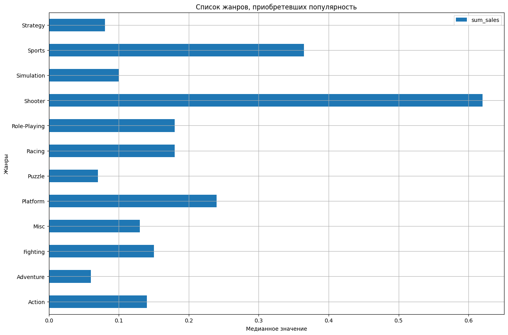

# Проектная работа: Определение выгодного тарифа для телеком компании

# Описание проекта

Мы аналитики компании «Мегалайн» — федерального оператора сотовой связи. Клиентам предлагают два тарифных плана: «Смарт» и «Ультра». Чтобы скорректировать рекламный бюджет, коммерческий департамент хочет понять, какой тариф приносит больше денег.

Нам предстоит сделать предварительный анализ тарифов на небольшой выборке клиентов. В вашем распоряжении данные 500 пользователей «Мегалайна»: кто они, откуда, каким тарифом пользуются, сколько звонков и сообщений каждый отправил за 2018-й год. Нужно проанализировать поведение клиентов и сделать вывод — какой тариф лучше.

# Описание тарифов
###### Тариф «Смарт»
1. Ежемесячная плата: 550 рублей
2. Включено 500 минут разговора, 50 сообщений и 15 Гб интернет-трафика
3. Стоимость услуг сверх тарифного пакета:
- Минута разговора — 3 рубля. Количество использованных минут и мегабайтов «Мегалайн» всегда округляет вверх. Если пользователь проговорил всего 1 секунду, в тарифе засчитывается целая минута.
- Сообщение — 3 рубля.
- 1 Гб интернет-трафика — 200 рублей.

###### Тариф «Ультра»
1. Ежемесячная плата: 1950 рублей
2. Включено 3000 минут разговора, 1000 сообщений и 30 Гб интернет-трафика
3. Стоимость услуг сверх тарифного пакета:
- Минута разговора — 1 рубль;
- Сообщение — 1 рубль;
- 1 Гб интернет-трафика: 150 рублей.

# Анализ данных
Исследовательский анализ данных и подсчёт помесячной выручки уже есть в проекте. 

Помесячная выручка вычисляется так:
- отнимим бесплатный лимит от суммарного количества звонков, сообщений и интернет-трафика;
- остаток умножим на значение из тарифного плана;
- к результату прибавим абонентскую плату, соответствующую тарифному плану.

# Проверка гипотезы
Нужно проверить две гипотезы о выручке пользователей. В качестве уровня значимости alpha возьмем 0.05 (5%).

# Описание данных

Таблица `users` — информация о пользователях:
- `user_id` — уникальный идентификатор пользователя
- `first_name` — имя пользователя
- `last_name` — фамилия пользователя
- `age` — возраст пользователя (годы)
- `reg_date` — дата подключения тарифа (день, месяц, год)
- `churn_date` — дата прекращения пользования тарифом (если значение пропущено, значит, тариф ещё действовал на момент выгрузки данных)
- `city` — город проживания пользователя
- `tarif` — название тарифного плана

Таблица `calls` — информация о звонках:
- `id` — уникальный номер звонка
- `call_date` — дата звонка
- `duration` — длительность звонка в минутах
- `user_id` — идентификатор пользователя, сделавшего звонок

Таблица `messages` — информация о сообщениях:
- `id` — уникальный номер звонка
- `message_date` — дата сообщения
- `user_id` — идентификатор пользователя, отправившего сообщение

Таблица `internet` — информация об интернет-сессиях:
- `id` — уникальный номер сессии
- `mb_used` — объём потраченного за сессию интернет-трафика (в мегабайтах)
- `session_date` — дата интернет-сессии
- `user_id` — идентификатор пользователя

Таблица `tariffs` — информация о тарифах:
- `tariff_name` — название тарифа
- `rub_monthly_fee` — ежемесячная абонентская плата в рублях
- `minutes_included` — количество минут разговора в месяц, включённых в абонентскую плату
- `messages_included` — количество сообщений в месяц, включённых в абонентскую плату
- `mb_per_month_included` — объём интернет-трафика, включённого в абонентскую плату (в мегабайтах)
- `rub_per_minute` — стоимость минуты разговора сверх тарифного пакета (например, если в тарифе 100 минут разговора в месяц, то со 101 минуты будет взиматься плата)
- `rub_per_message` — стоимость отправки сообщения сверх тарифного пакета
- `rub_per_gb` — стоимость дополнительного гигабайта интернет-трафика сверх тарифного пакета (1 гигабайт = 1024 мегабайта)

###### Пути к локальным файлам: 
- `datasets/calls.csv`
- `datasets/internet.csv`
- `datasets/messages.csv`
- `datasets/tariffs.csv`
- `datasets/users.csv`

###### Пути к файлам Яндекса Практикума: 
- `/datasets/calls.csv`
- `/datasets/internet.csv`
- `/datasets/messages.csv`
- `/datasets/tariffs.csv`
- `/datasets/users.csv`

# Итог

## Звонки
По графику (см. ниже) можно понять, что пользователь с тарифом `Smart` среднее количество звонков увеличивается с каждым месяцем, а пользователь с тарифом `Ultra` увеличивается, но с колебаниями. Далее выясним подробнее - рассмотрим нормальное распределение графика количество звонков и количество клиентов. Также  проверим на нулевую и альтернативную гипотезу.

Здесь (см. ниже) отчетливо видно, что пользователь с тарифом `Smart` имеет вид нормальное распределение, они чаще всего делают около 75 звонков. Выбросы минимален. Далее рассмотрим пользователя с тарифом `Ultra`. 

С пользователем тарифа `Ultra` ситуация здесь сложилась иная, нельзя сказать, что график имеет вид нормального распределения, он похоже на более расплющен. Т.к. известно, что в тарифе включена услуга "3000 минут разговора", пользователи не стараются как можно больше сэкономить и потратить все минуты.

Здесь (см. ниже) уже поинтереснее получается, пользователи с тарифом `Smart` стараются сэкономить минуты, т.к. в услугу входит "500 минут разговора". А пользователи с тарифом `Ultra` не беспокоятся об этом.

## Сообщение

Теперь рассмотрим со сообщениями.

Здесь уже очевидно, что среднее количество сообщений пользователя с тарифом `Ultra` больше пользователя с тарифом `Smart`.

## Интернет трафик

Теперь рассмотрим с интернетом трафика.

Здесь можно заметить, что пользователи тарифа `Smart` чаще всего расходуются 17000 Мегабайт - 16,6 Гбайт. Известно, что в тарифе включена услуга "15 Гб интернет-трафика". Есть пользователи, которые расходует вне диапазона, но количество таких пользователей сопоставимо малы. 

Пользователь с тарифом `Ultra` потребляют спокойно, график имеет расплющенный вид. 

## Проверка гипотезы

### Средняя выручка пользователей тарифов «Ультра» и «Смарт» различаются ли? Проверим.

- H_0 (Нулевая гипотеза): Выручка (total_cost) пользователей "Ультра" = выручка (total_cost) пользователей "Смарт"
- H_1 (Альтернативная гипотеза): Выручка (total_cost) пользователей "Ультра" ≠ выручка (total_cost) пользователей "Смарт"

Применим параметр: alpha = 0.05

В итоге получилось:

Следовательно, выручка (total_cost) пользователей "Ультра" **не равна** выручку (total_cost) пользователей "Смарт". Здесь не нужно пересмотреть услугу тарифа, чтобы увеличить выручку.

Проверим еще гипотезу:

### Пользователи из Москвы приносят ли больше выручки, чем пользователи из других городов? Проверим.

- H_0: Выручка (total_cost) пользователей из Москвы = выручка (total_cost) пользователей не из Москвы
- H_1: Выручка (total_cost) пользователей из Москвы ≠ выручка (total_cost) пользователей не из Москвы
Применим параметр: alpha = 0.05

Следовательно, выручка (total_cost) пользователей из Москвы **равна** выручку (total_cost) пользователей не из Москвы. Здесь получается, что независимо от какого региона проживания, все пользователи платят и пользуются тарифом.