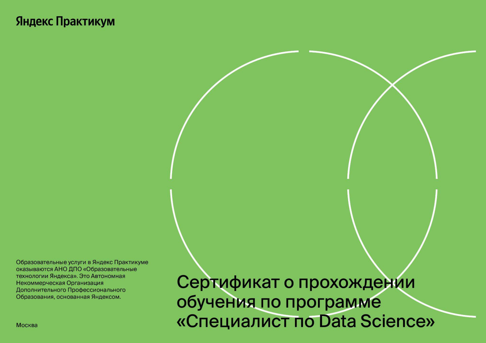
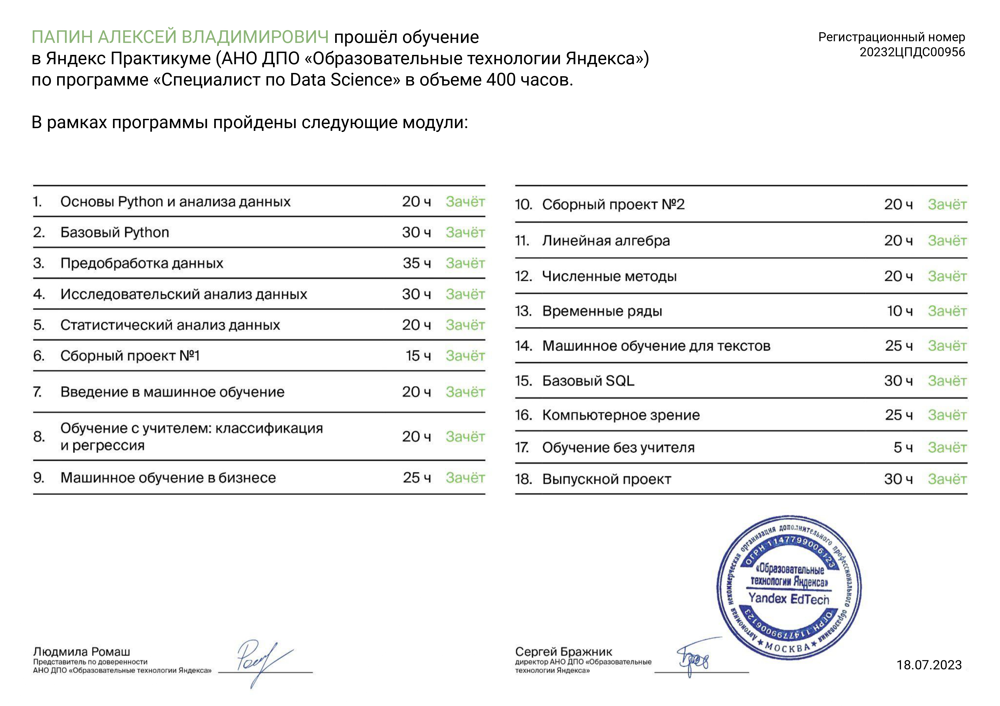

# Data Science: портфолио
Список проектов, выполненных в период обучения на курсе [Специалист по Data Science](https://practicum.yandex.ru/data-scientist/) в период 2022-2023

## **Проектные работы** 
|                                                                              Название проекта                                                                               |                                                                                      Направление |                                                                                                                                                                                Задачи проекта |                                                                                                                                                                                                                                                                                                                                                                                                                                                                                                                                                                                                                                                                                                                                                                                                                                                                                                                                                                                                                                                                                                                                                                                                                                                                                                                                                Использованные библиотеки |   
|:---------------------------------------------------------------------------------------------------------------------------------------------------------------------------:|-------------------------------------------------------------------------------------------------:|----------------------------------------------------------------------------------------------------------------------------------------------------------------------------------------------:|-------------------------------------------------------------------------------------------------------------------------------------------------------------------------------------------------------------------------------------------------------------------------------------------------------------------------------------------------------------------------------------------------------------------------------------------------------------------------------------------------------------------------------------------------------------------------------------------------------------------------------------------------------------------------------------------------------------------------------------------------------------------------------------------------------------------------------------------------------------------------------------------------------------------------------------------------------------------------------------------------------------------------------------------------------------------------------------------------------------------------------------------------------------------------------------------------------------------------------------------------------------------------------------------------------------------------------------------------------------------------:|
|       [Исследование данных сервиса “Яндекс.Музыка” — сравнение пользователей двух городов](https://github.com/RedAlexDad/YandexPracticum/tree/project_1_yandex_music)       |                                                                                   Data Analytics |    На реальных данных Яндекс.Музыки c помощью библиотеки Pandas и её возможностей проверить данные и сравнить поведение и предпочтения пользователей двух столиц — Москвы и Санкт-Петербурга. |                                                                                                                                                                                                                                                                                                                                                                                                                                                                                                                                                                                                                                                                                                                                                                                                                                                                                                                                                                                                                                                                                                                                                                                                                                                              |
| [Исследование надёжности заёмщиков — анализ банковских данных](https://github.com/RedAlexDad/YandexPracticum/tree/project_2_investigation_of_the_reliability_of_borrowers)  |                                                                Data Analytics, Financial Analyst |                                       На основе статистики о платёжеспособности клиентов исследовать влияет ли семейное положение и количество детей клиента на факт возврата кредита в срок. |                                                                                                                                                                                                                                                                                                                                                                                                                                                                                                                                                                                                                                                                                                                                                                                                                                                                                                                                                                                                                                                                                                                                                                                                                                                              |
|            [Продажа квартир в Санкт-Петербурге — анализ рынка недвижимости](https://github.com/RedAlexDad/YandexPracticum/tree/project_3_research_data_analysis)            |                                                   Marketing Analyst, Fraud Analyst, Data Analyst |                                                               Используя данные сервиса Яндекс.Недвижимость, определить рыночную стоимость объектов недвижимости и типичные параметры квартир. |                                                                                                                                                                                                                                                                                                                                                                                                                                                                                                                                                                                                                                                                                                                                                                                                                                                                                                                                                                                                                                                                                                                                      |
|                 [Определение выгодного тарифа для телеком компании](https://github.com/RedAlexDad/YandexPracticum/tree/project_4_statistical_data_analysis)                 |                                                 Marketing Analyst, Product Analyst, Data Analyst |                                                                            На основе данных клиентов оператора сотовой связи проанализировать поведение клиентов и поиск оптимального тарифа. |                                                                                                                                                                                                                                                                                                                                                                                                                                                                                                                                                                                                                                                                                                                                                                                                                                                                                                                                                                                                                            |
|                     [Классификаиция клиентов телеком компании](https://github.com/RedAlexDad/YandexPracticum/tree/project_5_recommendation_of_tariffs)                      |                                                                 Machine learning, Classification |                                                                                                                                                    На основе данных предложить клиенту тариф. |                                                                                                                                                                                                                                                                                                                                                                                                                                                                                                                                                                                                                                                                                                                                                                                                                                                                                                                                                                                                                                                                                                                               |
|                            [Прогнозирование оттока клиента Банка](https://github.com/RedAlexDad/YandexPracticum/tree/project_6_customer_outflow)                            |                                                                 Machine learning, Classification |                                                                                                                              На основе данных из банка определить клиент, который может уйти. |                                                                                                                                                                                                                                                                                                                                                                                                                                                                                                                                                                                                                                                                                                                                                                                                                                                                                              |
|            [Определение наиболее выгодного региона нефтедобычи](https://github.com/RedAlexDad/YandexPracticum/tree/project_7_choosing_the_location_for_the_well)            |                      Machine learning, Regression, Business model development, Financial Analyst |                                                                                                                                 На основе данных геологи разведки выбрать район добычи нефти. |                                                                                                                                                                                                                                                                                                                                                                                                                                                                                                                                                                                                                                                                                                                                                                                                                                                                                                                                                                                                       |
|              [Защита данных клиентов страховой компании](https://github.com/RedAlexDad/YandexPracticum/tree/project_8_protection_of_personal_data_of_clients)               |                                                                                 Machine learning |                                                                                                                                           Разработка модели анонимизации персональных данных. |                                                                                                                                                                                                                                                                                                                                                                                                                                                                                                                                                                                                                                                                                                                                                                                                                                                                                                             |     
|               [Построение модели определения стоимости автомобиля](https://github.com/RedAlexDad/YandexPracticum/tree/project_9_determining_the_cost_of_cars)               |                                                                                 Machine learning |                                                                                                                  Разработка системы рекомендации стоимости автомобиля на основе его описания. |                                                                                                                                                                                                                                                                                                                                                                                                                                                                                                                                                                                                                                                                                                                                    |    
|             [Прогнозирование количества заказов такси на следующий час](https://github.com/RedAlexDad/YandexPracticum/tree/project_10_forecasting_taxi_orders)              |                                                                                 Machine learning |                                                                                                                                                Разработка системы предсказания объема заказа. |                                                                                                                                                                                                                                                                                                                                                                                                                                                       |    
|                      [Обучение модели классификации комментариев](https://github.com/RedAlexDad/YandexPracticum/tree/project_11_project_for_Wikishop)                       |                                                                      Natural language processing |                                                                                                                                                          Определение токсичности комментарии. |               |    
|                              [Обработка фотографий покупателя](https://github.com/RedAlexDad/YandexPracticum/tree/project_12_computer_vision)                               |                                                                Machine learning, Computer Vision |                                                                                                                                                           Определение возраста по фотографии. |                                                                                                                                                                                                                                                                                                                                                                                                                                                                                                                                                                                                                                                                                                                                                                                                                                                                                                                    |    
|                            [Исследование данных о продаже видеоигр](https://github.com/RedAlexDad/YandexPracticum/tree/prefabricated_project_1)                             |                                                                                   Data Analytics |                                                                                   На основе исторических данных выявить причину, определяющую успешность выпусков видеоигр по закономерности. |                                                                                                                                                                                                                                                                                                                                                                                                                                                                                                                                                                                                                                                                                                                                                                                                                                                                                                                                                                                                                            |    
|          [Исследование технологического процесса очистки золота](https://github.com/RedAlexDad/YandexPracticum/tree/prefabricated_project_2_gold_mining_industry)           |                                                            Machine learning, Analyst (universal) |                                                                                                                   Спрогнозировать концентрацию золота при проведении процесса очистки золота. |                                                                                                                                                                                                                                                                                                                                                                                                                                                                                                                                                                                                                                                                                                                                                                                    |    
|                                                                            **Выпускной проект**                                                                             |                                                                                  **Направление** |                                                                                                                                                                           **Задачи проекта**  |                                                                                                                                                                                                                                                                                                                                                                                                                                                                                                                                                                                                                                                                                                                                                                                                                                                                                                                                                                                                                                                                                                                                                                                                                                                                                                                                            **Использованные библиотеки** |   
|                 [Оптимизация производственные расходы в металлургическом комбинате](https://github.com/RedAlexDad/YandexPracticum/tree/graduation_project)                  | Machine learning, Analyst (universal), Regression, Business model development, Financial Analyst | Металлургический комбинат ООО «Так закаляем сталь» решил уменьшить потребление электроэнергии на этапе обработки стали, для этого нужно спрогнозировать конечную температуру плавления стали. |                                                                                                                                                                                                                                                                                                                                                                                                                                                                                                      |    

<!-- 
Скрытые стеки
 
 
 
 
 
 
 
 
 
 
 

 

-->

##### ДИПЛОМ

<table>
    <tr>
        <td>
            <h6>Диплом RU</h6>
            <a href="images/DiplomaRU.pdf">Кликните здесь</a>
        </td>
        <td>
            <h6>Diploma EN</h6>
            <a href="images/DiplomaEN.pdf">Click on here</a>
        </td>
    </tr>
</table>

