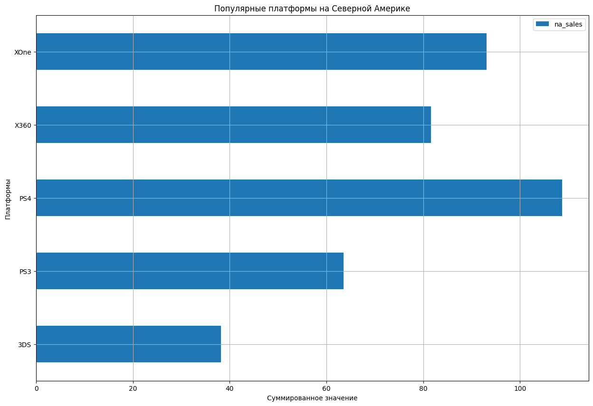
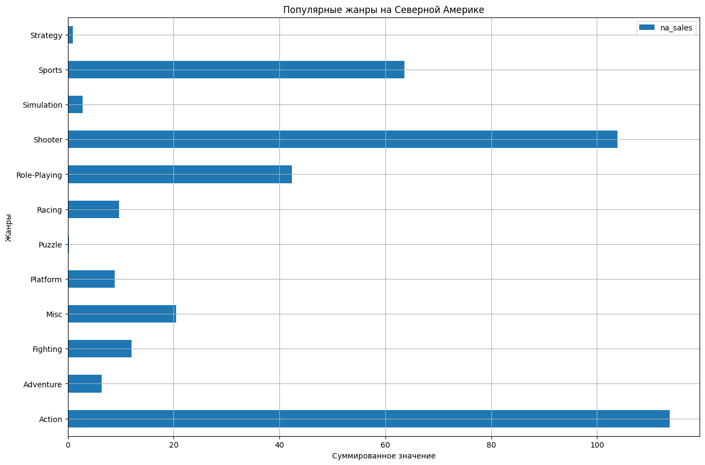
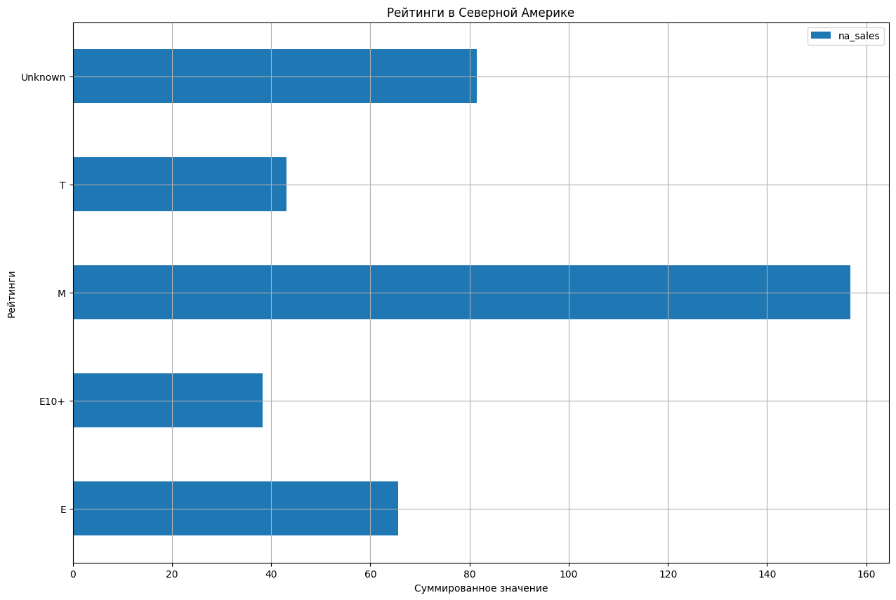
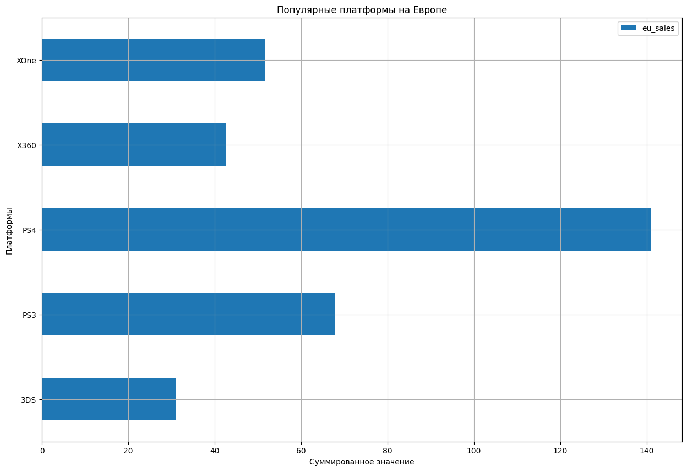
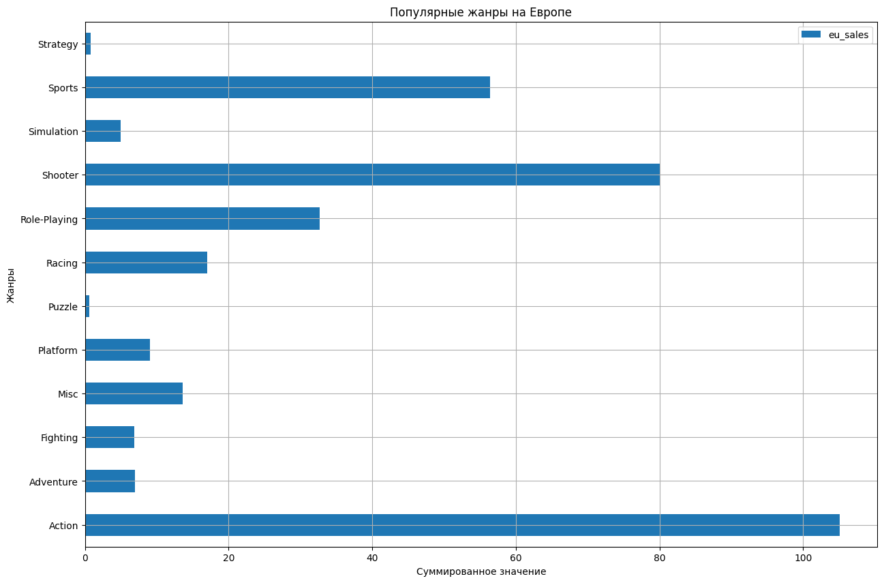
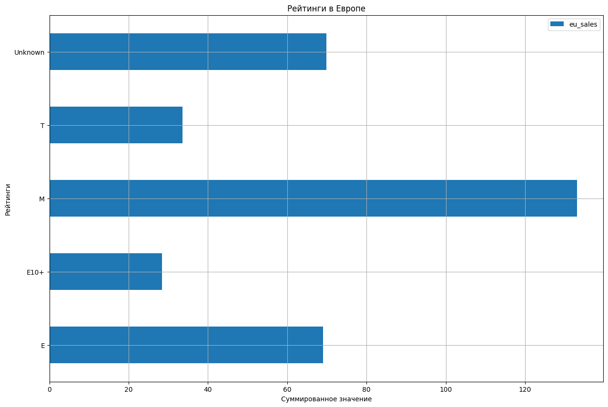
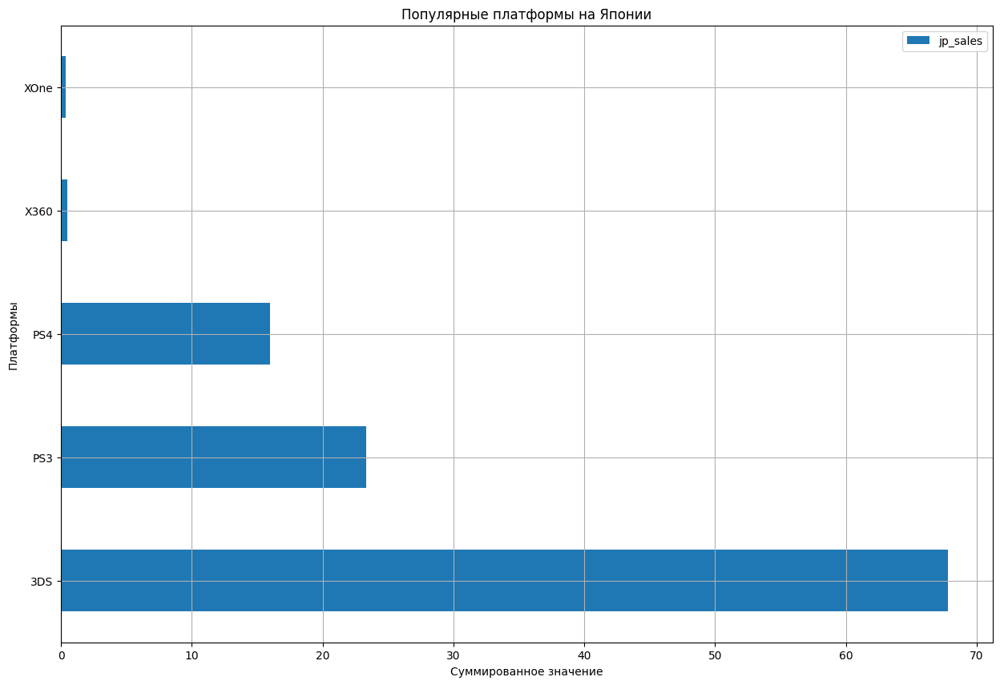
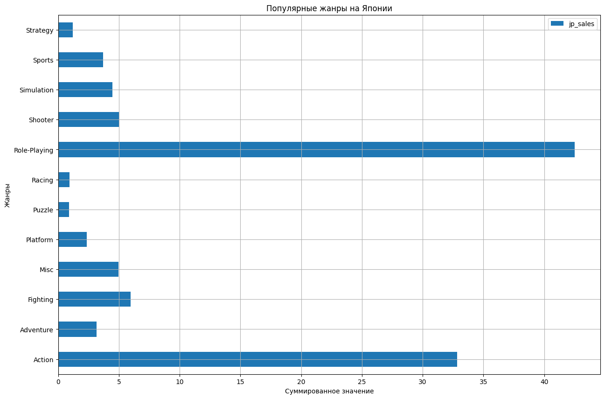
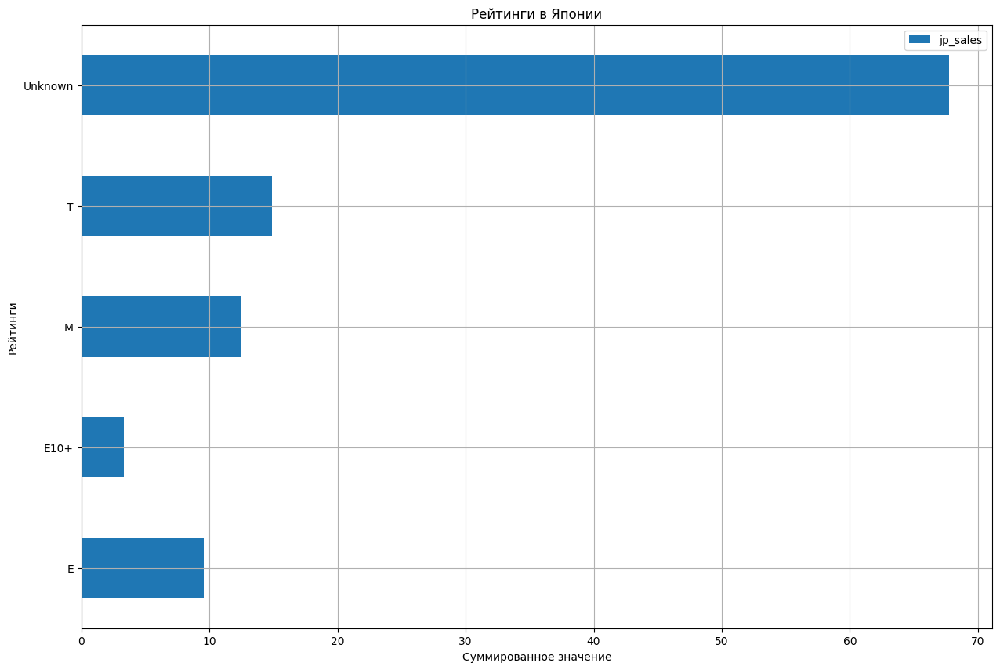

# Сборный проект 1: Интернет-магазин "Стримчик"

## Описание проекта

Предположим, мы работаем в интернет-магазине «Стримчик», который продаёт по всему миру компьютерные игры. 
Из открытых источников доступны исторические данные о продажах игр, оценки пользователей и экспертов, жанры и платформы (например, Xbox или PlayStation). 
Нам нужно выявить определяющие успешность игры закономерности. 
Это позволит сделать ставку на потенциально популярный продукт и спланировать рекламные кампании.

Перед нами данные до 2016 года. Представим, что сейчас декабрь 2016 г., и вы планируете кампанию на 2017-й. 
Нужно отработать принцип работы с данными. 
Неважно, прогнозируем ли мы продажи на 2017 год по данным 2016-го или же 2027-й — по данным 2026 года.

В наборе данных попадается аббревиатура ESRB (Entertainment Software Rating Board) — это ассоциация, определяющая возрастной рейтинг компьютерных игр. ESRB оценивает игровой контент и присваивает ему подходящую возрастную категорию, например, «Для взрослых», «Для детей младшего возраста» или «Для подростков».

## План по выполнению проекта
### Шаг 1. Изучение и подготовка данных
Путь к файлу: `datasets/games.csv.`

- Заменить названия столбцов (привести к нижнему регистру);
- Преобразовать данные в нужные типы. Описать, в каких столбцах заменить тип данных и почему;
- Обработать пропуски при необходимости:
  - Объяснить, почему заполнить пропуски определённым образом или почему не стал это делать;
  - Описать причины, которые могли привести к пропускам;
  - Обратить внимание на аббревиатуру 'tbd' в столбце с оценкой пользователей. Отдельно разобрать это значение и описать, как его обработать;
- Посчитать суммарные продажи во всех регионах и записать их в отдельный столбец.

### Шаг 2. Провести исследовательский анализ данных
- Посмотреть, сколько игр выпускалось в разные годы. Важны ли данные за все периоды?
- Посмотреть, как менялись продажи по платформам. Выбрать платформы с наибольшими суммарными продажами и построить распределение по годам. За какой характерный срок появляются новые и исчезают старые платформы?
- Взять данные за соответствующий актуальный период. Актуальный период определить самостоятельно в результате исследования предыдущих вопросов. Основной фактор — эти данные помогут построить прогноз на 2017 год.
- Не учитывать в работе данные за предыдущие годы.
- Какие платформы лидируют по продажам, растут или падают? Выбрать несколько потенциально прибыльных платформ.
- Построить график «ящик с усами» по глобальным продажам игр в разбивке по платформам. Описать результат.
- Посмотреть, как влияют на продажи внутри одной популярной платформы отзывы пользователей и критиков. Построить диаграмму рассеяния и посчитать корреляцию между отзывами и продажами. Сформулировать выводы.
- Соотнести выводы с продажами игр на других платформах.
- Посмотреть на общее распределение игр по жанрам. Что можно сказать о самых прибыльных жанрах? Выделяются ли жанры с высокими и низкими продажами?

### Шаг 3. Составить портрет пользователя каждого региона
- Определить для пользователя каждого региона (NA, EU, JP):
- Самые популярные платформы (топ-5). Описать различия в долях продаж.
- Самые популярные жанры (топ-5). Пояснить разницу.
- Влияет ли рейтинг ESRB на продажи в отдельном регионе?
### Шаг 4. Проверить гипотезы
- Средние пользовательские рейтинги платформ Xbox One и PC одинаковые;
- Средние пользовательские рейтинги жанров Action (англ. «действие», экшен-игры) и Sports (англ. «спортивные соревнования») разные.
- Задать самостоятельно пороговое значение alpha.
- Пояснить:
- Как сформулированы нулевая и альтернативная гипотезы;
- Какой критерий применить для проверки гипотез и почему.

### Шаг 5. Написать общий вывод
- Оформление: Выполните задание в Jupyter Notebook. Заполните программный код в ячейках типа code, текстовые пояснения — в ячейках типа markdown. Примените форматирование и заголовки.

## Описание данных
- `Name` — название игры
- `Platform` — платформа
- `Year_of_Release` — год выпуска
- `Genre` — жанр игры
- `NA_sales` — продажи в Северной Америке (миллионы проданных копий)
- `EU_sales` — продажи в Европе (миллионы проданных копий)
- `JP_sales` — продажи в Японии (миллионы проданных копий)
- `Other_sales` — продажи в других странах (миллионы проданных копий)
- `Critic_Score` — оценка критиков (максимум 100)
- `User_Score` — оценка пользователей (максимум 10)
- `Rating` — рейтинг от организации ESRB (англ. Entertainment Software Rating Board). Эта ассоциация определяет рейтинг компьютерных игр и присваивает им подходящую возрастную категорию.

Данные за 2016 год могут быть неполными.

# Исследовательская работа

## Анализ данных

После получения датасета у нас около 16715 единиц данных о названиях игры.

##### Информация о данных


##### Информация о датасете


## Предобработка данных

Заменили все названий столбцов к нижнему регистру. В целях экономии памяти преобразовали в другой тип данных. 

Ознакомили долю пропущенных значений, выяснили, что здесь огромная доля пропущенных значений являются колонки: `critic_score`, `user_score` и `rating`


Обработали с пропущенными значениями, заполнение заглушками `unknown`, и устранили дубликаты.

## Исследовательский анализ данных

### Графики

<table>
  <tr>
    <td><br/></td>
    <td><br/></td>
  </tr>
</table>

На графике можно заметить, что кол-во выпущенных игр растет, но не линейно.

Здесь можно заметить, что в периоде 2005 - 2010 годах некоторые приставки и устройства появились и исчезались. 

Но мы будем рассматривать в отдельном промежутке - **с 2013 по 2016 году**, чтобы взят ьданные за актуальные периоды на 2017


Здесь можно заметить, что игровые приставки (платформы): PS4 и 3DS к 2015 году подошли к росту, но после 2015 подошли к убытку. А у остальных платформ идут к убытку, а платформа PSP вышла с рынка в 2015 году
Стабильно держатся эти Wii, PC, PSV, но претерпевают малое количество убытки

Рассмотрим ящик с усами суммарной продажи к определенному платформу 2013-2016


Здесь можно заметить, что существуют большие выбросы у платформ. Но будем предположить, что выбросов не существуют и опираемся на существующих значениях. То здесь получается, что PS4 занимает неплохую позицию в продажах копий игр, но X360 не уступает ее.

3DS, к сожалению, не является внушительной кол-во копией игр для игровой платформы

Рассмотрим диаграмму рассеивания оценок критиков и пользователей к суммарной продаже

<table>
  <tr>
    <td><br/></td>
    <td><br/></td>
  </tr>
</table>

### Корреляция

Также рассмотрели корреляцию между отзывами и продажами, не учитывая "заглушки" и  других платформ

Корреляция между отзывами и продажами:
```text
Корреляция отзывами пользователя слабо отрицательная: -0.028835496282265085

Корреляция отзывами критиков слабо положительная: 0.4060021159350102
```

Можно сделать вывод, что большая часть продажи копией зависит от наличия высоких оценок

Корреляция других платформ:
```text
==================================================
Пользовательские рейтинги платформ PS3:
Корреляция слабо положительная: 0.023
--------------------------------------------------
Рейтинги критик платформ PS3:
Корреляция слабо положительная: 0.334
==================================================
Пользовательские рейтинги платформ X360:
Корреляция слабо отрицательная: -0.006
--------------------------------------------------
Рейтинги критик платформ X360:
Корреляция слабо положительная: 0.350
==================================================
Пользовательские рейтинги платформ PS4:
Корреляция слабо отрицательная: -0.029
--------------------------------------------------
Рейтинги критик платформ PS4:
Корреляция слабо положительная: 0.406
==================================================
Пользовательские рейтинги платформ XOne:
Корреляция слабо отрицательная: -0.098
--------------------------------------------------
Рейтинги критик платформ XOne:
Корреляция слабо положительная: 0.414
==================================================
Пользовательские рейтинги платформ 3DS:
Корреляция слабо положительная: 0.293
--------------------------------------------------
Рейтинги критик платформ 3DS:
Корреляция слабо положительная: 0.356
==================================================
```

##### Общее распределение игр по жанрам


Здесь можно заметить, что есть хиты по продажам: Shooter, Sports и Platform (Самые прибыльные)
Но также не уступают их по месту: Role-Playing и Racing
Список жанров, которые мало получили популярность: Adventure, Puzzle, Strategy (Самые убыльные)
Более мене популярностью занимают: Simulation и Misc

## Потреты пользователя каждого региона

### Северная Америка (NA)

<table>
  <tr>
    <td><br/></td>
    <td><br/></td>
    <td><br/></td>
  </tr>
</table>

Большинство американцы в возрасте около или старше 16 (в большинствах случаях) лет играют в основном на платформах PS4, XOne, X360 в жанрах Action, Shooter, Sports, Role-Playing и Misc

### Европейский регион (EU)

<table>
  <tr>
    <td><br/></td>
    <td><br/></td>
    <td><br/></td>
  </tr>
</table>

Большинство европейцы совпадают с вкусом и предпочтением американца, но играют в основном на японских платформах

### Японский регион (JP)

<table>
  <tr>
    <td><br/></td>
    <td><br/></td>
    <td><br/></td>
  </tr>
</table>

Большинство юные японцы играют на японских платформах, а их любимые жанры - Role-Playing

## Проверка гипотезы

##### Одинаковы ли средние пользовательские рейтинги платформ Xbox One и PC?

Ответ был получен: **да**, средние пользовательские рейтинги этих платформ одинаковы, т.е. они связаны между собой

##### Одинаковы ли средние пользовательские рейтинги жанров Action (англ. «действие», экшен-игры) и Sports (англ. «спортивные соревнования») разные?

Ответ был получен: **нет**, средние пользовательские рейтинги этих жанров не связаны

# Вывод

Если хотим развивать компьютерные игры в Северной Америке, то лучше всего разработать мультиплатформенную игру, поскольку платформа PC занимает невнушительное кол-во, т.к. американцы больше всего играют на платформах: Xbox 360, Wii и PS2. А жанры лучше всего подобрать Action, Sports, Shooter, Platform и Misc с рейтингом E, T и М.

Для развития европейского региона - (аналогично с ситуацией с Северной Америке), но лучше всего создать игру с поддержкой японских платформ, особенно: PS4, PS3, PS2. 

Для развития японского региона - исключительно на японских платформах создать игру, поскольку кол-во платформ PC очень мало (или вообще отсутствуют), что не является идеальным стартом для продажи игр на PC. Их любимые жанры Role-Playing, Action, Sports, Platform и Misc с рейтингом E, T и М.