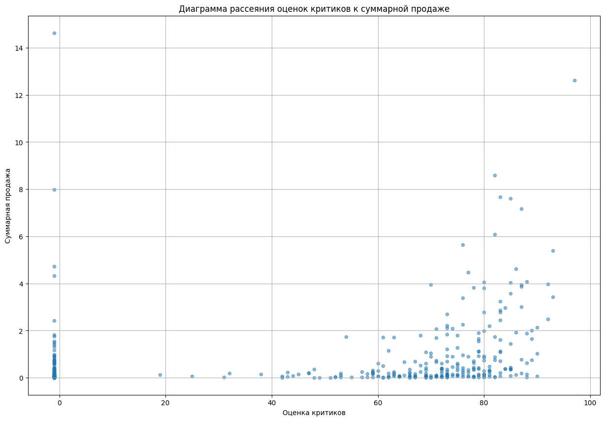
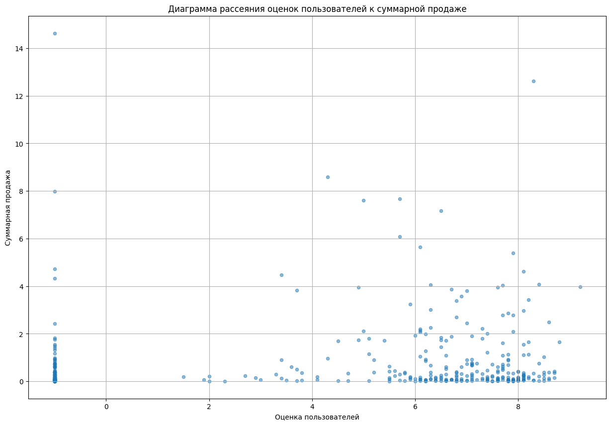

# Выпускной проект: Промышленность

## Вводная часть

Чтобы оптимизировать производственные расходы, металлургический комбинат ООО «Так закаляем сталь» решил уменьшить потребление электроэнергии на этапе обработки стали.

Нам предстоит построить модель, которая предскажет температуру стали.

## Описание этапа обработки

Сталь обрабатывают в металлическом ковше вместимостью около 100 тонн. Чтобы ковш выдерживал высокие температуры, изнутри его облицовывают огнеупорным кирпичом. Расплавленную сталь заливают в ковш и подогревают до нужной температуры графитовыми электродами. Они установлены в крышке ковша. 

Из сплава выводится сера (десульфурация), добавлением примесей корректируется химический состав и отбираются пробы. Сталь легируют — изменяют её состав — подавая куски сплава из бункера для сыпучих материалов или проволоку через специальный трайб-аппарат _**(англ. tribe, «масса»).**_

Перед тем как первый раз ввести легирующие добавки, измеряют температуру стали и производят её химический анализ. Потом температуру на несколько минут повышают, добавляют легирующие материалы и продувают сплав инертным газом. Затем его перемешивают и снова проводят измерения. Такой цикл повторяется до достижения целевого химического состава и оптимальной температуры плавки.

Тогда расплавленная сталь отправляется на доводку металла или поступает в машину непрерывной разливки. Оттуда готовый продукт выходит в виде заготовок-слябов _**(англ. *slab*, «плита»).**_

## Описание данных

Данные состоят из файлов, полученных из разных источников:

- `data_arc_new.csv` — данные об электродах;
- `data_bulk_new.csv` — данные о подаче сыпучих материалов (объём);
- `data_bulk_time_new.csv` *—* данные о подаче сыпучих материалов (время);
- `data_gas_new.csv` — данные о продувке сплава газом;
- `data_temp_new.csv` — результаты измерения температуры;
- `data_wire_new.csv` — данные о проволочных материалах (объём);
- `data_wire_time_new.csv` — данные о проволочных материалах (время).

Во всех файлах столбец `key` содержит номер партии. В файлах может быть несколько строк с одинаковым значением `key`: они соответствуют разным итерациям обработки.

### План работы

1. Исследовательская работа:
    - Изучить данные;
    - Провести графический анализ;
    - Если есть проблемы и аномалии в данных, то выписать какие-то идеи для их учёта/устранения/исправления выявленных в данных;
    - План работ по всему проекту (что мы считаем нужным сделать)
    - Вопросы по моделируемому процессу для бизнеса (к тимлиду)
2. Предобработка данных
    - Пропуски в данных по сыпучим продуктам и проволке можно заполнить нулями;
    - Объединить данные черезс помощью inner_join по ключу (номер партии) и провести исследование по нему;
    - Исследовать взаимную корреляцию признаков;
3. Построение модели 
    - Разделить на обучающую и тестовую выборку в соотношении `(0.75 и 0.25)`;
    - Масштабировать их (можно через Pipeline);
    - Обучить модель градиетными бустингами или другие семейства модели (не менее 2 разных моделей) через `GridSearchCV` (для повышения качеств обучения) или `RandomizedSearchCV` (для скорости обучения);
    - Добиться `MAE` не более `6.8`. В лучшем случае - `менее 6.0`;
    - Протестировать лучшую модель на тестовой выборке;
    - Сделать анализ важности признаков модели-победителя;
    - Сделать проверку модели на адекватность с помощью константной модели (можно через `DummyRegressor`).
4. Отчет
    - Сравненить решения и плана;
    - Описать трудностей проекта;
    - Выписать ключевые шаги решения;
    - Указать какие признаки, которые использовали для обучения и их обработка;
    - Напиасть полное описание модели (с гиперпараметрами, включая random_state, если используемся);
    - Написать итоговую метрику;
    - Оставить рекомендацию по улучшению решения.

# Итог

## Сравнение решения и плана

По изначальному плану нам было задано оптимизировать производственные расходы, потому что металлургический комбинат ООО «Так закаляем сталь» решил уменьшить потребление электроэнергии на этапе обработки стали.

И мы решили построить модель, которая предскажет температуру стали. Следовательно, нам необходимо создать таблицу, в которой содержатся данные начальные и конечные температуры плавления стали в каждой партии. Это было создано, чтобы передать целевой признак - `конечная температура плавления стали` для обучения модели.

Потому что предсказание конечной температуры плавления стали позволит оптимизировать процесс и достичь нужной температуры с минимальным потреблением энергии. И зная конечную температуру плавления, металлургический комбинат сможет контролировать и регулировать процесс нагрева стали, чтобы достичь оптимального химического состава и желаемой температуры плавления. Это поможет снизить издержки на энергию, улучшить качество продукции и повысить эффективность производства.

Мы строго придерживались по планам, по которым необходимо сделать следующее:

##### 1. Исследовательская работа
Провели исследовательскую работу, в которой мы ознакомились с данными, графическими анализами и наличиями аномальными значениями. Также выставили планы по работу по данному проекту.

- Обнаружили **супер аномальное значение** в датафрейме `Данные о электродах` - колонки `Реактивная мощность` -  `-715.479919`
- Обнаружили **огромные пропущенные значения** в датафрейме `Данные о подаче сыпучих материалов (объём)`, но нельзя не отметить, что есть корреляция сильно положительная - `Bulk 1` и `Bulk 13`, `Bulk 7` и `Bulk 14`, и еще другие, значения у которых составляют `0.7`, `0.84` и т.д. И существуют корреляция сильно отрицательная. 
- Обнаружили **неестественное явление** - температура плавления стали. Т.е. средняя температура выплавки стали, которого мы можем чаще всего встречать - `1591` градусов по цельсии. А самой максимальной температурой составляет `1705` градусов по цельсии. Минимальной - `1191` градусов по цельсии. Очень странно будет, если их оставлять, потому что, по идее, температура плавления стали должно быть не менее `1500` градусов по цельсии, пусть минимальным порогом окажется `1400` градусов по цельсии. 
- Обнаружили **огромные пропущенные значения** в датафрейме `Данные о проволочных материалах (объём)`, но также присутствуют наличия сильноположительной корреляции - `Wire 1` и `Wire 3` - `0,72` и сильноотрицательной - `Wire 4` и `Wire 7`- `-0,4`.

##### 2. Предобработка данных
Совершали предобработку данных, а именно удалили супер-выброс, пропуски, заполняли пропуски нулями, объединили в общий датафрейм для исследовании взаимной корреляции признаков, в которой обнаружили сильно положительную корреляцию и положительную корреляцию.

- Несмотря на то, что это задание **не является строго обязательным (будет простым решением не преобразовать в другой тип данных)** - преобразование в другой тип в целях облегчения данных, но это усложняет написание кода - поддержание и сопровождение кода. Мы преобразовали в другой тип данных, чтобы сэкономить объем памяти датасета.
- Проверили на наличие дублирующих значений. Результат показал, что их нет.
- Ранее мы выяснили, что существует супер-выброс - в датафрейме `Данные о электродах` - колонки `Реактивная мощность` -  `-715.479919`, и устранили его.
- Также устранили **неестественное явление** - температура плавления стали, т.е. устранили значения меньше `1500` градусов по цельсии. Но не только удалили значения температуры, но и по номеру партии `key` по этому датафрейму. Потому что при объединении он учитывает номер партии `key` и отсеивает эти **неестественное явление**.
- И устранили пропуски температуры в датафрейме `Результаты измерения температуры`. Количество пропусков составляет порядка: `738`. А количество партий, в которой не заполнены температуры: `3422`. Нельзя не отрицать, что их довольно достаточно, если учитывать, что размер датафрейме `Результаты измерения температуры` составляет: `18092` - **почти меньше четверти**
- Ознакомили с процентами потери данных после предобработки данных. Их очень мало, больше всего пострадали - датафрейм `Результаты измерения температуры` - `23.143%`
- Также заполнили пропуски нулями по несколькими датафреймами. Нам известно, что датафреймы `Данные о подаче сыпучих материалов (объём)` и `Данные о проволочных материалах (объём)` имели огромные пропуски, что и их заполнили много.
- Создали новую таблицу `Результаты измерения температуры`, в которой содержатся начальые и конечные температуры плавления стали и время. Была создана, чтобы установить целевой признак - `конечная температура плавления стали` для машинного обучения. 
- Агрегировали датафрейм `Данные о электродах`, чтобы дополнить несколько признаков для улучшения качеств машинного обучения и снижать сильно положительную корреляцию. После агрегировании получили четыре признаков: `key`, `Полная мощность`, `Время нагрева` и `Суммированная энергия по партии`. Приведенные формулы `Полная мощность`, `Время нагрева` и `Суммированная энергия по партии` прилагаю ниже - _пункт 5.2._
- Полученные данные после агрегирования и создания новой таблицы объединили 5 датафрейма: `Результаты измерения температуры`, `Агрегирование данных об электродах`, `Данные о подаче сыпучих материалов (объём)`, `Данные о проволочных материалах (объём)` и `Данные о продувке сплава газом`

##### Тепловая карта корреляции объединенных датафреймов

После объединении на тепловой карте корреляции обнаружили пропуски в колонке `Wire 5` и скоррелированные признаки `Bulk 9` и `Wire 8`, у которых сильно положительная корреляция (по установленному пределу мы должны устранить колонку, в которой превышает допустимый предел скоррелированные признаки - `0.9`).

И для улучшения качеств обучения было удалено колонки: `Wire 5`, номер партии `key`, `Bulk 9` и `Wire 8`

- Провели корреляцию объединенных датафреймов, и выяснились следующее:

Существуют положительная корреляция:
- `Bulk 2` и `Wire 4`
- `Bulk 2` и `Wire 6`
- `Bulk 2` и `Wire 7`

- `Bulk 7` и `Wire 4`
- `Bulk 7` и `Wire 6`
- `Bulk 7` и `Wire 7`

И при увеличении времени нагрева [c] увеличается суммарная энергии по партии
- `Heating time` и `Summed energy by key`

Существуют сильно положительная корреляция:
- `Bulk 9` и `Wire 8`
Но мы устранили это еще раньше

В большинствах случаях корреляция очень слабо отрицательная либо очень близки к нулю

- Убрали сильно положительную корреляцию `Bulk 9` и `Wire 8`, потому что их нельзя оставить, т.к. это сказывается на обучение линейным методом. Потому что, если есть мультиколлинеарности, то переменные модели становятся сильно зависимыми друг от друга, что это может делать оценку влияния каждой переменной на целевую переменную менее надежной. Что и может привести к нестабильности модели и переобучению. Не говоря уж о сложности интерпретации и низкой устойчивости модели.
- Положительная корреляция у нас есть несколько, и они говорят о том, что они движутся в одном направлении: при увеличении значения одной переменной, значение другой переменной также увеличивается. Т.е. что получается в итоге, при увеличении объема сыпучих материалов потребовались увеличению объемов проволочных материалов.
- Отрицательная корреляция (в нашем случае, когда значение равно или близки к нулю (темный цвет синий)) у нас их довольно много, и они говорят о том, что при увеличении объема сыпучих материалов потребовались уменьшению объемов проволочных материалов, иным словами можно сказать, что объем спыучих материалов независимо зависит от объема проволочных материалов.

##### 3. Настройка модели
Для метрических и линейных моделей сильно положительная корреляция плохо сказывается на обучение, и что решили удалить сильно положительную корреляцию.

И мы масштабировали признаки для линейных моделей, потому что они и нейронные сети требуют стандартизации, т.к. известно, что методы обучения этих моделей (градиетный спуск) плохо обучаются, если "ланшафт" оптимизируемой поверхности сильно вытянут. И гораздо быстрее сходятся если признаки одного масштаба.

Для деревьев стандартизация точно не важна, поскольку разбиения всегда идут по одному конкретному признаку и масштаб соседних признаков никак на это не влияет.
Однако на самом деле на простой линейной регрессии стандартизация также не окажет никакого влияния, поскольку все изменения переменной можно нивелировать за счет изменения коэффициента:

##### 4. Семейства модели

Мы расширили несколько семейств моделей, чтобы нам достались большие возможности с подбором лучших моделей и протестировать с ними.

Список семейств моделей:

1. **Линейные методы**
- `LinearRegression`
- `Ridge Regressor`
- `ElasticNet`
- `Bayesian`
- `RidgeCV`
2. **Методы деревьев**
- `DecisionTreeRegressor`
- `RandomForestRegressor`
- `ExtraTreesRegressor`
3. **Градиетные бустинги**
- `AdaBoostRegressor`
- `LightGBMRegressor`
- `CatBoostRegressor`
- `GradientBoostingRegressor`
- `XGBRegressor`
4. **Другие методы**
- `KNeighborsRegressor`
- `MLPRegressor`
- `GaussianProcessRegressor`

Мы рассмотрели разные варианты модели в общей сложности `16` моделей.

###### 5. Анализ важности признаков модели-победителя

После тестирования лучшей модели провели анализ важности признаков, чтобы построить метрику, которая позволяет оценить вклад каждого признака в предсказательную способность модели. Более высокие значения означают, что признак вносит больший вклад в предсказания модели, а более низкие значения указывают на меньший вклад.

Однако важность признаков не является абсолютной мерой и может быть относительной для конкретной модели. Важность признаков может изменяться в зависимости от выбранной модели и ее настройки. Это означает, что не существует единого правильного способа определения важности признаков, и каждая модель может давать свои результаты.

При построении бизнеса на основе важного признака важно учитывать не только результаты одной модели, но и проводить анализ и сравнить результатов различных моделей. Различные модели могут давать разные важности признаков, и важно принимать во внимание эту вариативность. 

Также важно учитывать предметную область и экспертные знания, чтобы понять, какие признаки действительно имеют бизнес-значимость.

Подведем ТОП 5 значимых признаков:
1. `Bulk 7`
2. `Bulk 6`
3. `Bulk 15`
4. `start temperature` - `Начальная температура`
5. `heating time` - `Время нагрева`

Подведем ТОП 5 незначимых признаков:
1. `Bulk 8`
2. `Wire 9`
3. `Bulk 3`
4. `Bulk 10`
5. `Wire 6`

И отсутствуют признаки, которые не входят в списках важности

##### 6. Проверка модель на адекватность

После тестировании провели константную модель, потому что проверка на константную модель является важным этапом в процессе разработки и оценки модели. Зачастую это делается в качестве базового сравнения для оценки производительности и эффективности предлагаемой модели. 

И проверка на константную модель позволяет определить, насколько предлагаемая модель действительно способна предсказывать и обобщать данные. Константная модель представляет собой простейший прогноз, который не учитывает никаких входных данных и всегда выдает одно и то же значение. 

Сравнение предсказаний предлагаемой модели с предсказаниями константной модели позволяет оценить, насколько модель действительно улучшает предсказания по сравнению с простейшим подходом. Если модель не превосходит константную модель, это может указывать на проблемы в ее проектировании или недостаточную информацию для предсказания.

MAE константной модели получилось вполне удовлетворительной оценкой - `8.104991`, т.е. получилось больше заявленной необходимости - `6,8`. 

Разница между константной модели и тестовой модели составляет: `8.104991` - `6.410872` = `1.694119`

Что и говорит о успешном построении и моделировании машинного обучения.

## Используемые признаки для обучения и их обработка

Мы использовали признаков для обучения:
- `key` - `Номер партии`,
- `start_temperature` - `Начальная температура плавления стали`, 
- `power` - `Полная мощность`, 

Полная мощность - суммарная величина, которая включает в себе как активную, так и реактивную составляющие мощность

Мы получили по формуле:

- `heating_time` `Время нагрева дугой`, 

Время нагрева дугой получили по вычетам конечной времени нагрева дугой и начальной времени нагрева дугой

- `energy` `Энергия (Выделенная энергия для нагрева)`, 

Энергию получили за счет умножения время на полную мощность:

- `summed_energy_by_key` - `Суммированная выделенной энергии по каждой партии`, 

где: 

- `Объем ковша для насыпки руды`:

`bulk_1`, `bulk_2`, `bulk_3`, `bulk_4`, `bulk_5`, `bulk_6`, `bulk_7`, `bulk_8`, `bulk_9`, `bulk_10`, `bulk_11`, `bulk_12`, `bulk_13`, `bulk_14`, `bulk_15`;

- `Объем проволочного материала`:

`wire_1`, `wire_2`, `wire_3`, `wire_4`, `wire_6`, `wire_7`, `wire_8`, `wire_9`;

- `gas` - `Инертный газ для нагрева`;

А целевой признак:
- `end_temperature` - `Конечная температура плавления стали`

## Трудности проекта

Трудности проекта заключается в этапах предобработки данных, потому что присутствуют огромные пропуски, особенно в датасетах температуры. Также в ходе предобработки выяснили неточные данные, а именно аномальные значения и нелогичные данные (тепмпература плавления стали около `1200` градусов по цельсии, а в ковше плавления от `1500` градусов по цельсии). 

Также непросто поддерживать код и отлаживать его, потому что после деления модель на обучающую и тестовую выборку, в которых не сохраняют типы переменной, которая я ранее преобразовал данные в целях облегчения и уменьшения занимаемой памяти. То есть, после преобразования я получаю датасет с типами данных: `int32`, `float32`, `datatime[ns]`. А после деления получаем: `int64`, `float64`, `datatime[ns]`. Приходится прибегнуть к дополнительному написанию кода для поддержания. 

Также я не являюсь специалистом по области материаловедения и технологического процесса обработка стали. Пришлось прибегнуть к справочному материалу, чтобы выявлять предельную температуру плавления стали и ознакомиться с диаграммой плавления стали. 

## Полное описание модели

Мы применяли несколько моделей на обучение, но одним из них оказалась лучшей - модель `XGBRegressor`, значение метрики MAE которой составляет `6.410872`, время на обучение `0.18491` (намного меньше 1 секунда), и гиперпараметры: 

 - `'colsample_bytree': 0.8`,
 - `'gamma': 0.2`,
 - `'learning_rate': 0.1`,
 - `'max_depth': 5`,
 - `'n_estimators': 100`,
 - `'subsample': 0.8`

И также установили параметр:
`random_state: 50623`

Разделили модель на обучающую и тестовую выборку в пропорциях: `75%` и `25%`

Прилагаю ниже список используемые модели. В таблице мы можем ознакомиться с метрикой `MAE`, время обучения и лучшие гиперпараметры. 

## Итоговая метрика

После выбора лучшей модели и теста получили итоговую метрику, которая оказалась вполне приемлемым для эксплуатации

Результат получилось очень неплохим - MAE `6.410872`. Среднее значение предсказанной температуры составляет `1594` градусов по цельсии. А время на обучение составляет намного меньше 1 секунда. Это вполне оптимальное значение для внедрения и эксплуатации. 

## Рекомендация по улучшению

У меня есть несколько рекомендаций по улучшению качества модели машинного обучения для предсказания конечной температуры плавления стали:

- Рабочие с предприятии не должны оставлять пропуски. Поскольку проект столкнулся с проблемой большого количества пропущенных значений и неточных данных, необходимо уделить особое внимание этапу предобработки данных. 
- Рассмотреть другие возможности создания новых признаков, которые могут содержать дополнительную информацию о процессе обработки стали. Например, мы можем добавить ещё признаки, которые связаны с временными интервалами, статистическими показателями или химическим составом материала. Это может помочь модели получить **намного больше информации и улучшить прогнозы**.
- Привлечь специалиста в области материаловедения и технологического процесса обработки стали, чтобы получить обратную связь и советы. А также для построения сложных формул плавки стали с многими учетами: пассивное охлаждение ковша (наружный воздух в цехе охлаждает ковш), марки стали, теплоемкость стали, и т.д.
- Приборные устройства должны быть устойчивыми и бесперебойно работали, чтобы получили точные данных без лишних шумов

