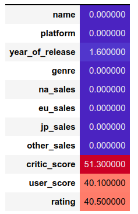

# Сборный прокет 2: Исследование технологического процесса очистки золота

## Описание проекта

Строитстся модель машинного обучения для промышленной компании, разрабатывающая решения для эффективной работы промышленных предприятий. 
Модель должна предсказать коэффициент восстановления золота из золотосодержащей руды на основе данных с параметрами добычи и очистки. 
Модель поможет оптимизировать производство, чтобы не запускать предприятие с убыточными характеристиками.

Примените знания к реальной задаче Data Science из золотодобывающей отрасли. Проект предоставлен компанией [«Цифра»](https://www.zyfra.com/).

Данные находятся в трёх файлах:
- `gold_recovery_train_new.csv` — обучающая выборка;
- `gold_recovery_test_new.csv` — тестовая выборка;
- `gold_recovery_full_new.csv` — исходные данные.

Данные индексируются датой и временем получения информации (признак date). Соседние по времени параметры часто похожи.

Некоторые параметры недоступны, потому что замеряются и/или рассчитываются значительно позже. Из-за этого в тестовой выборке отсутствуют некоторые признаки, которые могут быть в обучающей. Также в тестовом наборе нет целевых признаков.

Исходный датасет содержит обучающую и тестовую выборки со всеми признаками.

В нашем распоряжении сырые данные: их просто выгрузили из хранилища. 
Прежде чем приступить к построению модели, необходимо проверить по инструкции их на корректность.

## Постановка задачи

Нам нужно подготовить прототип модели машинного обучения для «Цифры». Компания разрабатывает решения для эффективной работы промышленных предприятий.

Модель должна предсказать коэффициент восстановления золота из золотосодержащей руды. В вашем распоряжении данные с параметрами добычи и очистки. 

Модель поможет оптимизировать производство, чтобы не запускать предприятие с убыточными характеристиками.

Нам нужно:
1. Подготовить данные;
1. Провести исследовательский анализ данных;
1. Построить и обучить модель.

Чтобы выполнить проект, обращайтесь к библиотекам pandas, matplotlib и sklearn. Вам поможет их документация.

Следующий урок посвящён технологическому процессу очистки руды. Нам нужно самому решать, какие детали нужны для построения модели, а какие — нет.

## Технологический процесс

Как золото получают из руды? Здесь приложены все стадии процесса.

Когда добытая руда проходит первичную обработку, получается дроблёная смесь. Её отправляют на флотацию (обогащение) и двухэтапную очистку.


Опишем каждую стадию: 

**1. Флотация**

Во флотационную установку подаётся смесь золотосодержащей руды. После обогащения получается черновой концентрат и «отвальные хвосты», то есть остатки продукта с низкой концентрацией ценных металлов.

На стабильность этого процесса влияет непостоянное и неоптимальное физико-химическое состояние флотационной пульпы (смеси твёрдых частиц и жидкости).

**2. Очистка**

Черновой концентрат проходит две очистки. На выходе получается финальный концентрат и новые отвальные хвосты.

## Описание данных
**Технологический процесс**

- `Rougher feed` — исходное сырье
- `Rougher additions` (или reagent additions) — флотационные реагенты: `Xanthate`, `Sulphate`, `Depressant`
    - `Xanthate` **— ксантогенат (промотер, или активатор флотации);
    - `Sulphate` — сульфат (на данном производстве сульфид натрия);
    - `Depressant` — депрессант (силикат натрия).
- `Rougher process` (англ. «грубый процесс») — флотация
- `Rougher tails` — отвальные хвосты
- `Float banks` — флотационная установка
- `Cleaner process` — очистка
- `Rougher Au` — черновой концентрат золота
- `Final Au` — финальный концентрат золота

**Параметры этапов**

- `air amount` — объём воздуха
- `fluid levels` — уровень жидкости
- `feed size` — размер гранул сырья
- `feed rate` — скорость подачи
### Наименование признаков

Наименование признаков должно быть такое:

`[этап].[тип_параметра].[название_параметра]`

Пример: `rougher.input.feed_ag`


Возможные значения для блока `[этап]`:
- `rougher` — флотация
- `primary_cleaner` — первичная очистка
- `secondary_cleaner` — вторичная очистка
- `final` — финальные характеристики

Возможные значения для блока [тип_параметра]:
- `input` — параметры сырья
- `output` — параметры продукта
- `state` — параметры, характеризующие текущее состояние этапа
- `calculation` — расчётные характеристики

### Расчёт эффективности

Нам нужно смоделировать процесс восстановления золота из золотосодержащей руды. 

Эффективность обогащения рассчитывается по формуле


где:
- C — доля золота в концентрате после флотации/очистки;
- F — доля золота в сырье/концентрате до флотации/очистки;
- T — доля золота в отвальных хвостах после флотации/очистки.

Для прогноза коэффициента нужно найти долю золота в концентратах и хвостах. 
Причём важен не только финальный продукт, но и черновой концентрат.

### Метрика качества

Для решения задачи введём новую метрику качества — sMAPE (англ. Symmetric Mean Absolute Percentage Error, «симметричное среднее абсолютное процентное отклонение»).

Она похожа на MAE, но выражается не в абсолютных величинах, а в относительных. Почему симметричная? Она одинаково учитывает масштаб и целевого признака, и предсказания.

Метрика sMAPE вычисляется так:


Обозначения:


- Значение целевого признака для объекта с порядковым номером i в выборке, на которой измеряется качество.


- Значение предсказания для объекта с порядковым номером i, например, в тестовой выборке.


- Количество объектов в выборке.


- Суммирование по всем объектам выборки (i меняется от 1 до N).

Нужно спрогнозировать сразу две величины:
- эффективность обогащения чернового концентрата rougher.output.recovery;
- эффективность обогащения финального концентрата final.output.recovery.

Итоговая метрика складывается из двух величин:


### Инструкция по выполнению проекта
1. Подготовить данные
    1. Открыть файлы и изучить их.
    
        Путь к файлам:
        - `/datasets/gold_recovery_train_new.csv`
        - `/datasets/gold_recovery_test_new.csv`
        - `/datasets/gold_recovery_full_new.csv`

    2. Проверить, что эффективность обогащения рассчитана правильно. Вычислить её на обучающей выборке для признака rougher.output.recovery. Найти MAE между вашими расчётами и значением признака. Описать выводы.
    3. Проанализировать признаки, недоступные в тестовой выборке. Что это за параметры? К какому типу относятся?
    4. Провести предобработку данных.

2. Проанализировать данные
    1. Посмотреть, как меняется концентрация металлов (Au, Ag, Pb) на различных этапах очистки. Описать выводы.
    2. Сравнить распределения размеров гранул сырья на обучающей и тестовой выборках. Если распределения сильно отличаются друг от друга, оценка модели будет неправильной.
    3. Исследовать суммарную концентрацию всех веществ на разных стадиях: в сырье, в черновом и финальном концентратах. 

3. Построить модель
    1. Написать функцию для вычисления итоговой **sMAPE**.
    2. Обучить разные модели и оцените их качество кросс-валидацией. Выбрать лучшую модель и проверьте её на тестовой выборке. Описать выводы.

Нам пригодятся формулы метрик качества:


# Исследовательская работа

## Получение датасетов и ознакомление
После получения несколько датасетов у нас имеются:
- Обучающая выборка: `14149` строк
- Тестовая выборка: `5290` строк
- Исходные данные: `19439` строк

Рассмотрели с описательной статисткой, ничего особенного не выявили.
Также рассмотрели кол-во пропущенных значений, их не так много. Заполнили заглушкой `-1`.
Не выявили наличие дубликатов.

Рассчитали эффективность обогащения, в среднем они составляют `87`. 
Находили метрику `MAE` - `9.73`, что и вполне неплохо.
И обнаружили, что отсутствуют признаки в тестовой выборки: `rougher.output.recovery`, `final.output.recovery` вещественного типа.

## Анализ данных

Рассмотрим график, как меняется концентрация металлов (Au, Ag, Pb) на различных этапах очистки.

### Гистограмма распределения концентрации золота в первом и втором этапе очистки

<table>
    <td>
        <h6>Первый этап очистки</h6>
        <br/>
    </td>
    <td>
        <h6>Второй этап очистки</h6>
        <br/>
    </td>
</table>


Как видно, что после флотации концетрация увеличилась кратно. 
Но после первого этапа очистки очистки концентрация металла тоже намного увеличилась, отвальных хвостов практически мало. 
Концетрацию металла после второго этапа очистки получилось отличным результатом - высокой.


### Гистограмма распределения концентрации серебро в первом и втором этапе очистки

<table>
    <td>
        <h6>Первый этап очистки</h6>
        <br/>
    </td>
    <td>
        <h6>Второй этап очистки</h6>
        <br/>
    </td>
</table>

Здесь как то печально получилось, что концентрации отвальных хвостов больше остальных. 
А после первого этапа очистки концентрация серебра намного меньше по сравнению до этапа очистки, 
т.е. концентрация вернулась до изначального уровня.
Насчет второго этапа очистки здесь не совсем уж сладко получилось, концентрация все меньше меньше. Значит, чтобы получить много серебра, придется придерживаться этапа очистки, т.е. после флотации достаточно будет.

### Гистограмма распределения концентрации свинец в первом и втором этапе очистки

<table>
    <td>
        <h6>Первый этап очистки</h6>
        <br/>
    </td>
    <td>
        <h6>Второй этап очистки</h6>
        <br/>
    </td>
</table>

Здесь немного получше по сравнению со серебром, отвальных хвостов меньше и держится на уровне до флотации. После первого этапа очистки концентрация примерно сравняется до этапа очистки. 
Насчет второго этапа очистки здесь отвальных хвостов мало, неплохо получилось. А концентрация после второго очистки получилась примерно такой же, но сужалась в диапазонах, а кол-во металлов кратно увеличилось.


### Рассмотрим график суммарную концентрацию всех веществах на 4 различных стадиях: до флотации, после флотации, первого и второго этапа очистки


Как видно, что после после флотации концентрация металлов увеличилась кратно, а после первого этапа очистки диапазон концентрации металлов стал шире, что приводит к нехорошему делу. Однако после второго этапа очистки концентрация металлов очень кратно увеличилась, а диапазон сужалась

###  Сравним распределения размеров гранул сырья на обучающей и тестовой выборках. Если распределения сильно отличаются друг от друга, оценка модели будет неправильной

Также применяли математический метод, а именно, равенство распределений выборок тестом Манна-Уитни, чтобы выявлять, распределения равны или нет.
- H0 - распределения равны
- H1 - распределения не равны

<table>
    <td>
        <h6>Размер гранул до флотации</h6>
        <br/>
        <pre><code>
        Медиана обучающей выборки: 55.27
        Медиана тестовой выборки: 50.85
        p-value: 4.757516657683611e-112
        Отвергаем нулевую гипотезу. Распределения не равны.
        </code></pre>
    </td>
    <td>
        <h6>Размер гранул до первого очистки (после флотации)</h6>
        <br/>
        <pre><code>
        Медиана обучающей выборки: 7.29
        Медиана тестовой выборки: 7.25
        p-value: 8.911921244496388e-11
        Отвергаем нулевую гипотезу. Распределения не равны
        </code></pre>
    </td>
</table>

Также рассмотрели график, который рассчитывает суммарную концентрацию по исходному сырью.


После каждого этапа очистки суммарная концентрация всех металлов снижается.

## Машинное обучение и тестирование

### Функция **sMAPE**

Была создана функция, которая вычисляется итоговую метрику **sMAPE**

```python
# Функция метрика качества - sMAPE
def sMAPE(target, predictions):
    return np.mean(2 * abs(target - predictions) / (abs(target) + abs(predictions))) * 100
```
и итоговую **sMAPE**
```python
def total_sMAPE(rougher, final):
    return 0.25 * rougher + 0.75 * final
```

### Машинное обучение

Применяли 3 разных моделей машинного обучения:
- LinearRegression
- DecisionTreeRegressor
- RandomForestRegressor

Рассмотрим результаты всех обученных моделей

```text
===============================================================================================================================
Имя модели: LinearRegression
-------------------------------------------------------------------------------------------------------------------------------
Целевой признак: rougher.output.recovery
sMAPE: 15.568631847356016
-------------------------------------------------------------------------------------------------------------------------------
Целевой признак: final.output.recovery
sMAPE: 12.3126731302587
-------------------------------------------------------------------------------------------------------------------------------
Итоговый sMAPE: 13.126662809533029
===============================================================================================================================
Имя модели: DecisionTreeRegressor
-------------------------------------------------------------------------------------------------------------------------------
Целевой признак: rougher.output.recovery
sMAPE: 9.909898604766392
-------------------------------------------------------------------------------------------------------------------------------
Целевой признак: final.output.recovery
sMAPE: 10.140296030591333
-------------------------------------------------------------------------------------------------------------------------------
Итоговый sMAPE: 10.082696674135098
===============================================================================================================================
Имя модели: RandomForestRegressor
-------------------------------------------------------------------------------------------------------------------------------
Целевой признак: rougher.output.recovery
sMAPE: 10.685345482057851
-------------------------------------------------------------------------------------------------------------------------------
Целевой признак: final.output.recovery
sMAPE: 9.237797158732779
-------------------------------------------------------------------------------------------------------------------------------
Итоговый sMAPE: 9.599684239564047
===============================================================================================================================
```

Лучшей модели оказалась модель Случайные леса. Да, Решающее дерево выигрывает по времени, но нам нужно высокое качество метрики sMAPE, поэтому выберем Случайные леса?

### Проверка в тестовой выборке

Выбрали лучшую модель и протестировали на тестовой выборке `gold_recovery_test_new.csv` и получилось:

##### Обогащения чернового концентрата `rougher.output.recovery`
```text
Предсказания модели: 82.19905261233072
sMAPE rougher: 9.62031368919572
```
##### Обогащения финального концентрата `final.output.recovery`
```text
Предсказания модели: 65.78028091442444
sMAPE final: 9.306437801362371
```
##### Итоговая sMAPE
```text
9.384906773320708
```

### Проверка на константной модели

Также проверили константную модель - `DummyRegressor`. 

##### Обогащения чернового концентрата `rougher.output.recovery`
```text
Предсказания констатной модели: 82.86100309474136
sMAPE rougher: 9.659422949144009
```
##### Обогащения финального концентрата `final.output.recovery`
```text
Предсказания констатной модели: 65.860087868964
sMAPE rougher: 9.886153712948415
```
##### Итоговая sMAPE
```text
9.829471021997314
```

Здесь интересно получается, что sMAPE тестовой модели меньше констатной модели, разница составляет лишь 0,0446%. Расхождение такого метрика самая минимальная, значит модель достигнула к минимальной ошибке

# Вывод

В течение отладки выяснили, что отсутствуют признаки: `rougher.output.recovery`, `final.output.recovery` вещественного типа. 
И было решено протестировать на исходную выборку. 
Также выяснили пропущенные значения в некоторых датасетах, что и решили убрать их, чтобы не искажать на исследование.

В ходе анализа данных узнали, что концентрация золота после второго этапа очистки оказалась намного выше чем после флотации и первого этапа очистки. 
Ситуация со серебром оказалось другой, т.е. концентрация серебра сильно упала после первого этапа очистки. 
Чтобы сохранить высокую концентрацию серебра, придется воздержаться этапы очистки. 
Со свинцом ситуация более приемлемая, после второго этапа очистки принесет удовлетворительную оценку концентратов.

Лучшей модели обучения оказался метод `DecisionTreeRegressor`, также было проведено тестирование на модели, сравнивая с константной модели - `DummyRegressor`. 
Разница между значениями итогового **sMAPE** константной модели и тестовой модели составляет около `1%`. 
Разница невелика, значит ошибка на тестовой выборки была **неощутимой**.